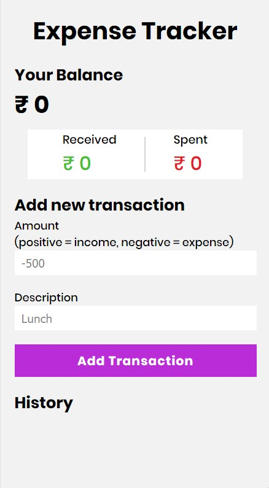
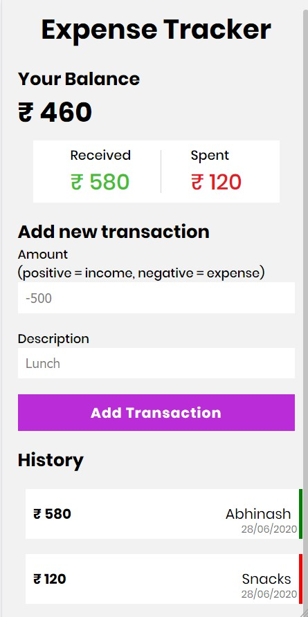

# Expense Tracker

### A simple app built using React which tracks your expenses

> ## Available at https://skyexpensetracker.netlify.app

## Usage

```
# Install all dependecies (requires Node and npm)
npm install

# Run on http://localhost:3000
npm start

# Build for production
npm run build
```

## How it looks




